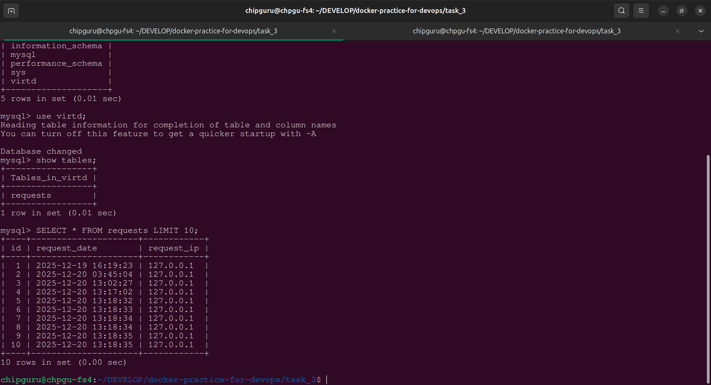

# Task 3 — Docker Compose + FastAPI + MySQL + HAProxy + Nginx

Этот проект демонстрирует работу веб‑приложения на **FastAPI**, которое принимает HTTP‑запросы, записывает информацию в базу данных **MySQL**, а также обслуживается через цепочку прокси‑серверов **Nginx → HAProxy → web**.


**Что делает приложение**

FastAPI‑сервис:

принимает запросы на /

определяет IP клиента (через Nginx → X‑Real‑IP)

записывает время и IP в таблицу requests

возвращает строку вида: TIME: 2025‑12‑20 18:44:12, IP: 127.0.0.1

При старте приложение автоматически создаёт таблицу requests, если её нет.

Маршрутизация запросов

```
curl → 127.0.0.1:8090
       ↓
Nginx (host mode)
       ↓
HAProxy (172.20.0.5:5000)
       ↓
FastAPI (web)
       ↓
MySQL (db)
```

**Запуск проекта**

В каталоге task_3:

```
docker compose up -d
```
Проверка:


```
curl -L http://127.0.0.1:8090
```
Ожидаемый ответ — время и IP.

**Подключение к MySQL**

```
docker exec -ti db mysql -uroot -p<root_password>
```
Команды sql:
```
show databases;
use virtd;
show tables;
SELECT * FROM requests LIMIT 10;
```
Остановка проекта

```
docker compose down -v
```

