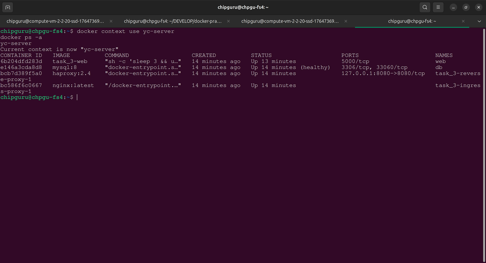
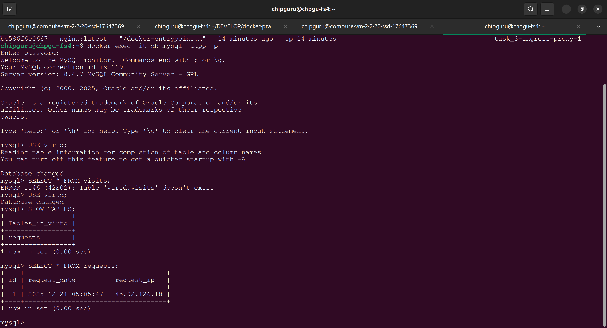

# Task 4 — Docker Compose, Nginx, HAProxy, FastAPI, MySQL
Этот проект поднимает инфраструктуру из четырёх сервисов:

- ingress‑proxy (Nginx)
- reverse‑proxy (HAProxy)
- backend (FastAPI)
- db (MySQL)

Все сервисы запускаются через Docker Compose.

### Запуск проекта
1. Создайте файл .env в каталоге task_3 (на *удалённом* сервере в каталоге /opt/docker-practice-for-devops/task_3/):

```
MYSQL_ROOT_PASSWORD=YtReWq4321
MYSQL_DATABASE=virtd
MYSQL_USER=app
MYSQL_PASSWORD=QwErTy1234

DB_HOST=db
DB_USER=app
DB_PASSWORD=QwErTy1234
DB_NAME=virtd
```
Запустите проект:

```
docker compose up -d --build
```
Проверьте доступность сервиса:

```
http://<SERVER_IP>:8090/
```
### Remote SSH Docker Context
Создание контекста:

```
docker context create yc-server --docker "host=ssh://<USER_NAME>@<SERVER_IP>"
```
Список контекстов:

```
docker context ls
```


Переключение на удалённый контекст:

```
docker context use yc-server
docker ps -a

```
Пример вывода (скриншот):



### SQL‑запрос на сервере
Подключение к MySQL:

```
docker exec -it db mysql -uapp -p

```
Запрос:

```
USE virtd;
SELECT * FROM requests;

```
Пример результата (скриншот):

