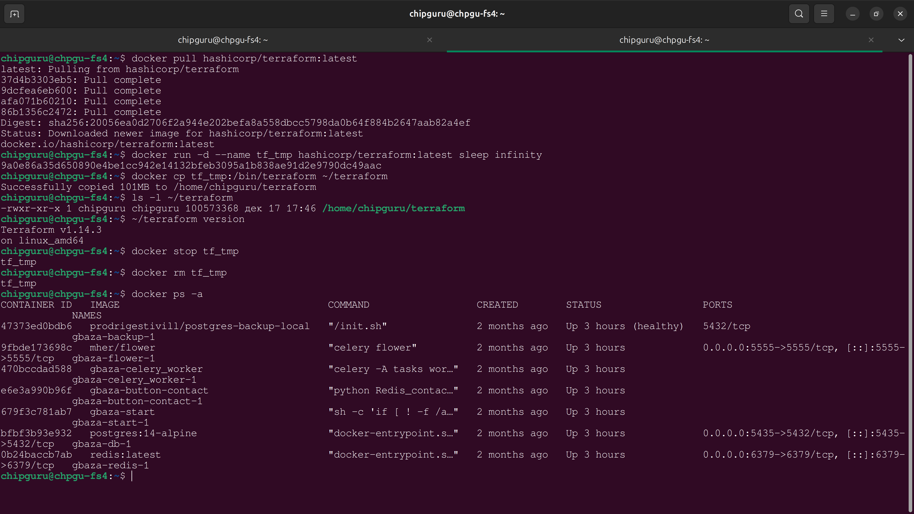

# Извлечение бинарника Terraform из Docker‑образа с помощью docker cp
## 1. Скачиваем образ Terraform

```
docker pull hashicorp/terraform:latest
```

## 2. Запускаем временный контейнер

```
docker run -d --name tf_tmp hashicorp/terraform:latest sleep infinity
```
## 3. Копируем бинарник Terraform на локальную машину

```
docker cp tf_tmp:/bin/terraform ~/terraform
```

## 4. Проверяем, что бинарник работает

```
~/terraform version
```
## 5. Останавливаем и удаляем временный контейнер

```
docker stop tf_tmp
docker rm tf_tmp
```

