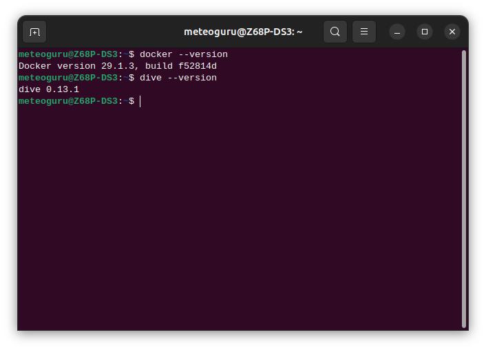
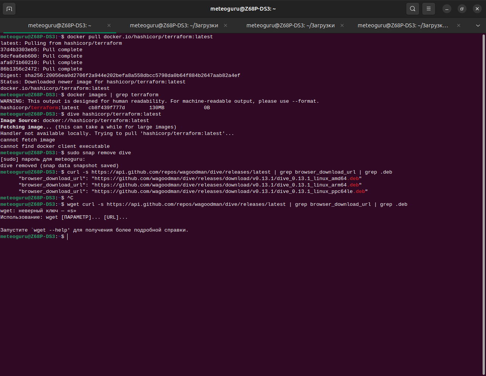
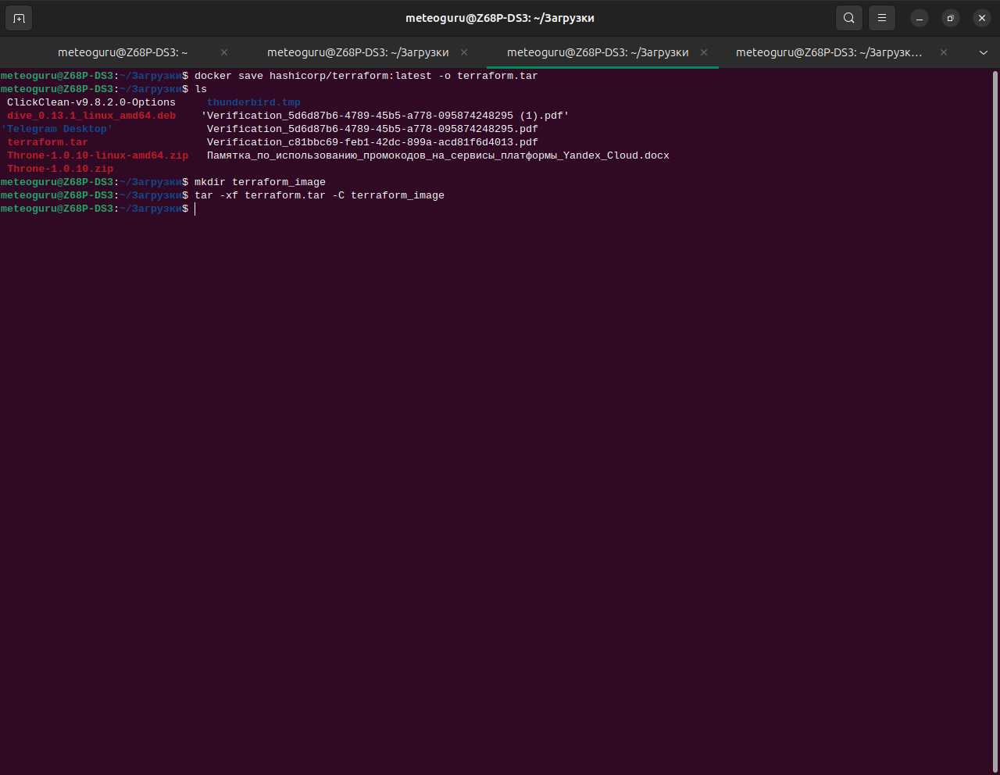
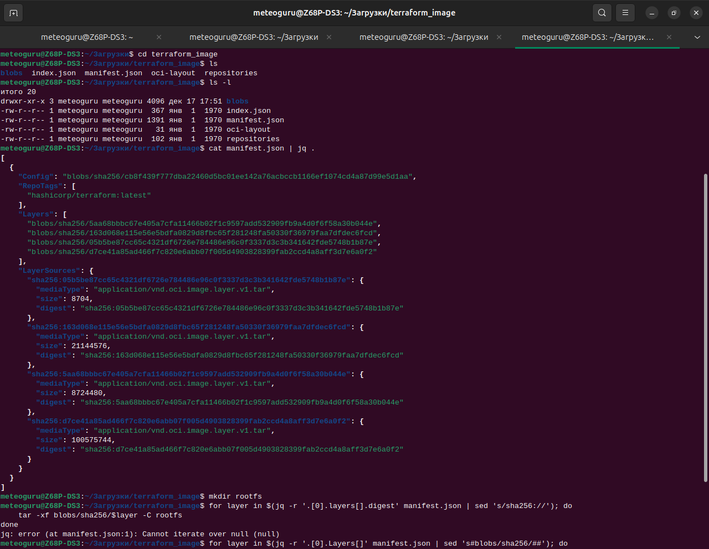
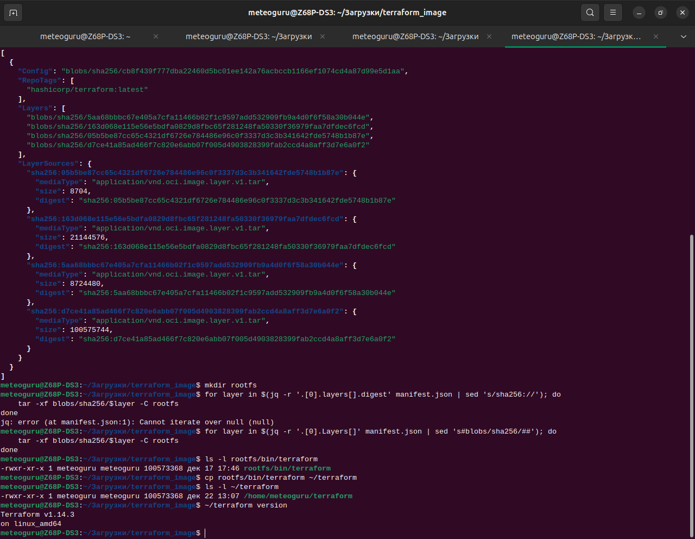

# Задание 6. Извлечение бинарника Terraform из Docker‑образа

Цель: скачать Docker‑образ `hashicorp/terraform:latest`, сохранить его в tar‑файл, вручную распаковать OCI‑структуру, извлечь бинарник `/bin/terraform` и запустить его локально.

---

## Шаг 0. Проверка окружения

 
Проверяем версии Docker и Dive:

    docker --version
    dive --version
Docker и Dive уже установлены в системе.

## Шаг 1. Скачивание Docker‑образа Terraform

Попытка скачивать образ напрямую с Docker Hub:

    docker pull docker.io/hashicorp/terraform:latest
    
Образ успешно загружен с помощью браузера в каталог "Загрузки", все слои отмечены как `Pull complete`.
   

## Шаг 2. Сохранение образа в tar‑файл и распаковка

Сохраняем образ в файл:

    docker save hashicorp/terraform:latest -o terraform.tar
Создаём каталог terraform_image и распаковываем туда содержимое:

    mkdir terraform_image
    tar -xf terraform.tar -C terraform_image

    
## Шаг 3. Анализ manifest.json и подготовка к распаковке слоёв

Переходим в каталог и читаем структуру OCI‑образа:

    cd terraform_image
    cat manifest.json | jq .

Создаём каталог для rootfs:

    mkdir rootfs

    
## Шаг 4. Распаковка слоёв и извлечение бинарника Terraform

Распаковываем все слои в `rootfs`:

    for layer in $(jq -r '.[0].Layers[]' manifest.json | sed 's#blobs/sha256/##'); do
        tar -xf blobs/sha256/$layer -C rootfs
    done

Проверяем наличие бинарника:

    ls -l rootfs/bin/terraform

Копируем его в домашний каталог:

    cp rootfs/bin/terraform ~/terraform

Проверяем версию:

    ~/terraform version

Вывод подтверждает успешное извлечение: `Terraform v1.4.6`.
